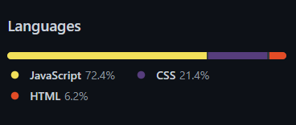

<h1 style="text-align: center;
  color: rgb(251, 255, 0);">Hi there! I'm Agus Villagrán👋🏽</h1>
<h3 style="text-align: center;
  color: rgb(251, 255, 0);">Web Full Stack Developer</h3>
 

Well well, let's start a short presentation about me:

 
<ul style="color: yellow;">I love...
  <li style="color: white;">rainy days. ⛈</li>
  <li style="color: white;">cold team. ❄</li>
  <li style="color: white;">read. 📚</li>
</ul> 
 
<ul style="color: yellow;">I prefer...
  <li style="color: white;">coding with classic music. 🎻</li>
  <li style="color: white;">back-end development. 🔙</li>
  <li style="color: white;">salty food. 🍕</li>
</ul>
 
<ul style="color: yellow;">I'm...
  <li style="color: white;">Open to contribute to philanthropic projects. ⛑</li>
  <li style="color: white;">Finishing SoyHenry's Bootcamp 🏁.</li>
  <li style="color: white;">Open to work. 🙋🏽‍♂️</li>
</ul>
 
<h3 style="text-align: center;
  color: rgb(251, 255, 0);">Want to know more about me? 👇🏽</h3>
 
<ul> Conect with me... <in class=""></in>
  <li style="color: white;"><a href="https://drive.google.com/file/d/1tfB4gQmv-b3fgCqXlRKgIkZHT6HoQcvP/view?usp=sharing">My foundations and experience 🖖🏽</a></li>
  <li style="color: white;"><a href="https://www.linkedin.com/in/agust%C3%ADn-villagr%C3%A1n/" target="blank">My LinkedIn </a></li>
  <li style="color: white;"><a href="mailto:magustin.villagran@gmail.com">Mail me 📩</a></li>
</ul>
 
<ul style="color: yellow;">Some skills...
  <li style="color: white;">Lenguages</li>
     
    

      
      
      
    

     
  <li style="color: white;">Enviroment tools</li>
     
    

       
      
    

     
  <li style="color: white;">DDBB</li>
     
    

      
    

     
  <li style="color: white;">Back-end</li>
     
    

      
      
    

     
  <li style="color: white;">Front-end</li>
     
      

        
        
        
      

     
  <li style="color: white;">Cooming soon</li>
   
    

      
      
      
    

   
</ul>

